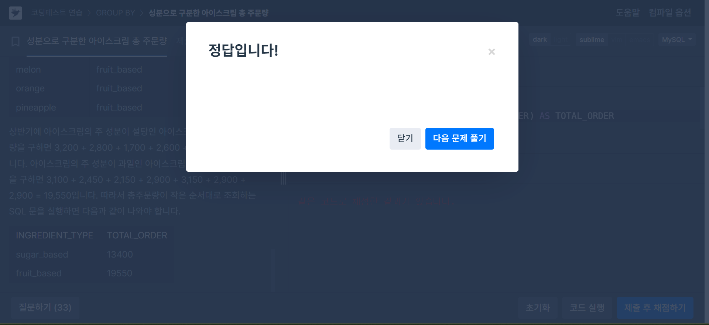

# 5주차(데이터 구조, CONCAT)

## 🏁 문제풀이 - [JOIN] 성분으로 구분한 아이스크림 총 주문량
🌱 상반기 동안 각 아이스크림 성분 타입과 성분 타입에 대한 아이스크림의 총주문량을 총주문량이 작은 순서대로 조회하는 SQL 문을 작성해주세요. 
이때 총주문량을 나타내는 컬럼명은 `TOTAL_ORDER`로 지정해주세요.

```
# 정답 코드
SELECT INGREDIENT_TYPE, SUM(TOTAL_ORDER) AS TOTAL_ORDER
  FROM FIRST_HALF F
  JOIN ICECREAM_INFO I
    ON F.FLAVOR = I.FLAVOR
 GROUP BY INGREDIENT_TYPE
 ORDER BY TOTAL_ORDER;

# 지난 학기에 풀었던 정답 코드
코드를 비교해보면, 좀 더 깔끔해진 걸 볼 수 있음(뿌듯😊)
SELECT B.INGREDIENT_TYPE, SUM(A.TOTAL_ORDER) AS TOTAL_ORDER
  FROM FIRST_HALF AS A
  JOIN ICECREAM_INFO AS B
    ON A.FLAVOR = B.FLAVOR
 GROUP BY B.INGREDIENT_TYPE
 ORDER BY SUM(A.TOTAL_ORDER) ASC;
 ```




## 🏁 문제풀이 - [MAX] 즐겨찾기가 가장 많은 식당 정보 출력하기
🌱 `REST_INFO` 테이블에서 음식종류별로 즐겨찾기수가 가장 많은 식당의 음식 종류, ID, 식당 이름, 즐겨찾기수를 조회하는 SQL문을 작성해주세요.
이때 결과는 음식 종류를 기준으로 내림차순 정렬해주세요.

```
# 정답 코드

# 지난 학기에 풀었던 정답 코드
SELECT FOOD_TYPE,REST_ID,REST_NAME,FAVORITES
  FROM REST_INFO
 ORDER BY FOOD_TYPE DESC;
 ```


## 🏁 문제풀이 - [WINDOW] 조건에 맞는 사원 정보 조회하기
🌱 

```
# 정답 코드

# 지난 학기에 풀었던 정답 코드
SELECT P.ID, NAME, P.HOST_ID
  FROM PLACES P
  JOIN (SELECT HOST_ID
  FROM PLACES
 GROUP BY HOST_ID
 HAVING COUNT(ID) >= 2) AS A 
    ON P.HOST_ID = A.HOST_ID
 ORDER BY ID;

 ```

## 6-2. WITH 구문

## 🧽Clear!🫧