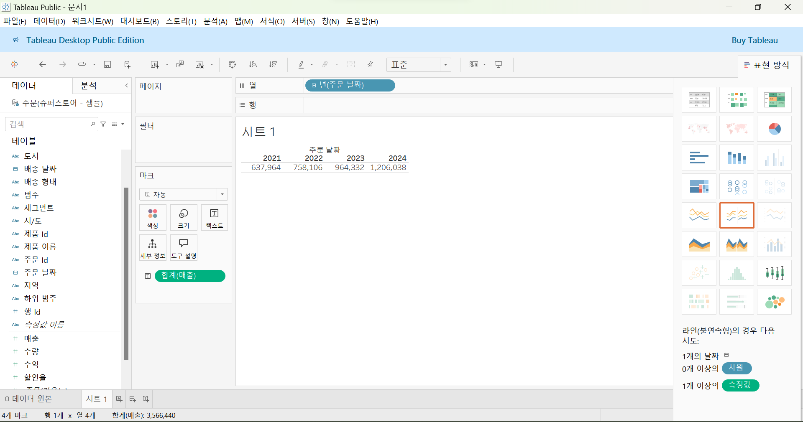
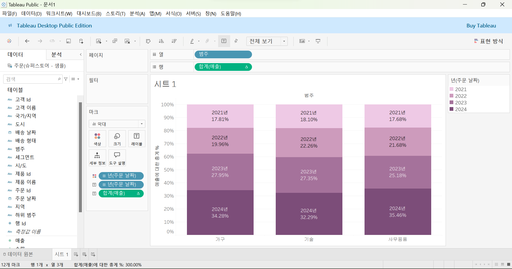
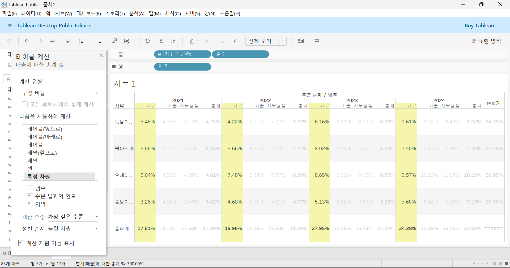

# Second Study Week

- 10강: [차원과 측정값](#10강-차원과-측정값)

- 11강: [시각화](#11강-시각화)

- 12강: [막대그래프](#12강-막대그래프)

- 13강: [누적막대그래프](#13강-누적막대그래프)

- 14강: [병렬막대그래프](#14강-병렬막대그래프)

- 15강: [누적병렬막대그래프](#15강-누적병렬막대그래프)

- 16강: [라인그래프](#16강-라인그래프)

- 17강: [맵작성](#17강-맵작성)

- 18강: [텍스트테이블](#18강-텍스트테이블)

- 19강: [트리맵과 하이라이트테이블](#19강-트리맵과-하이라이트테이블)

- 문제1 : [문제1](#문제1)

- 문제2 : [문제2](#문제2)

- 참고자료 : [참고자료](#참고-자료)


## Study Schedule

| 강의 범위     | 강의 이수 여부 | 링크                                                                                                        |
|--------------|---------|-----------------------------------------------------------------------------------------------------------|
| 1~9강        |  ✅      | [링크](https://youtu.be/3ovkUe-TP1w?si=CRjj99Qm300unSWt)       |
| 10~19강      | ✅      | [링크](https://www.youtube.com/watch?v=AXkaUrJs-Ko&list=PL87tgIIryGsa5vdz6MsaOEF8PK-YqK3fz&index=75)       |
| 20~29강      | 🍽️      | [링크](https://www.youtube.com/watch?v=AXkaUrJs-Ko&list=PL87tgIIryGsa5vdz6MsaOEF8PK-YqK3fz&index=65)       |
| 30~39강      | 🍽️      | [링크](https://www.youtube.com/watch?v=e6J0Ljd6h44&list=PL87tgIIryGsa5vdz6MsaOEF8PK-YqK3fz&index=55)       |
| 40~49강      | 🍽️      | [링크](https://www.youtube.com/watch?v=AXkaUrJs-Ko&list=PL87tgIIryGsa5vdz6MsaOEF8PK-YqK3fz&index=45)       |
| 50~59강      | 🍽️      | [링크](https://www.youtube.com/watch?v=AXkaUrJs-Ko&list=PL87tgIIryGsa5vdz6MsaOEF8PK-YqK3fz&index=35)       |
| 60~69강      | 🍽️      | [링크](https://www.youtube.com/watch?v=AXkaUrJs-Ko&list=PL87tgIIryGsa5vdz6MsaOEF8PK-YqK3fz&index=25)       |
| 70~79강      | 🍽️      | [링크](https://www.youtube.com/watch?v=AXkaUrJs-Ko&list=PL87tgIIryGsa5vdz6MsaOEF8PK-YqK3fz&index=15)       |
| 80~89강      | 🍽️      | [링크](https://www.youtube.com/watch?v=AXkaUrJs-Ko&list=PL87tgIIryGsa5vdz6MsaOEF8PK-YqK3fz&index=5)        |


<!-- 여기까진 그대로 둬 주세요-->
<!-- 이 안에 들어오는 텍스트는 주석입니다. -->

# Second Study Week

## 10강: 차원과 측정값

<!-- 차원과 측정값에 관해 배우게 된 점을 적어주세요 -->
기본적으로 차원은 불연속형 필드, 측정값은 연속형 필드로 분류됨.\
불연속형은 개별적으로 구분되는 값인 반면 연속형은 단절이 없는 무한한 범위의 값임.\
차원과 측정값은 영역을 기준으로 중심이 구분되며 불연속형은 파란색과 녹색으로 구분됨.\
때문에 시각화하고자 하는 방식에 따라서 연속형과 불연속형 두 가지 필드를 모두 활용할 수 있음.

*필드값은 차원 또는 측정값에 저장된 개별 값을 의미함.


> **🧞‍♀️ 차원과 측정값의 고유한 특성에 대해 설명해주세요.**

```
- 차원 : 데이터 집합에서 범주형 데이터를 나타내는 필드
차원은 일반적으로 데이터를 구분하거나 그룹화하는 데 사용된다.
차원을 활용하면 데이터를 여러 범주로 나누어 볼 수 있고, 이는 데이터의 범위나 분류를 표현하는 데 효과적이다.
ex) '제품명'은 차원이면서 불연속형 필드

- 측정값 : 데이터 집합에서 수치형 데이터를 나타내는 필드
측정값은 일반적으로 차원에 따라 요약되거나 집계된다.
즉, 차원에 따라 구분된 각 범주에 대해 특정 값을 계산하거나 표시하는 데 사용된다.
수치형 데이터를 포함하고, 일반적으로 합계, 평균, 최대값 등의 집계 함수가 적용된다.

차원은 막대를 구분하는 기준이 되고, 측정값은 각 막대의 높이를 결정하는 값이 된다.
```

*Quiz: 차원은 불연속형이고, 측정값은 연속형이다*\
→ 일반적으로 o but 아닌 경우도 있음


## 11강: 시각화

<!-- 시각화 관해 배우게 된 점을 적어주세요 -->

태블로는 데이터를 처음과 측정값으로 필드를 구성함!
뷰를 작성할 때는 이 데이터 패널의 필드를 시트로 추가하면 됨
데이터 필드를 시트에 추가하는 방법?

1. 주문 날짜, 매출 필드 각각 더블클릭

2. 열선반, 행선반으로 각각 drag & drop

3. 주문 일자 + 매출 필드 (ctrl 누른 채로), 시트로 drag & drop

4. 마크 창 활용(주문일자 > 열선반, 매출 필드 > 마크창 > 텍스트)


우측에 표현 방식 > 태블로가 해당 데이터를 가장 효과적으로 나타낼 수 있는 시각화 방법을 추천하여 나타냄
차원 : 독립적인 값=주문일자 / 측정값 : 차원의 세부항목(대부분 연속형 -> 패널로 표시됨)=매출


*Quiz: 차원은 대부분 불연속형이며 표 형태로 시각화했을 때 머리글로 표시되고, 측정값은 대부분 연속형이므로 표 형태로 시각화 진행했을 때 패널로 추가된다.(o, x)*

## 12강: 막대그래프

<!-- 막대그래프에 관해 배우게 된 점을 적어주세요 -->

여러 범주의 데이터를 비교할 때 유용하게 활용될 수 있음!

✅ 가로 막대그래프? 기존 막대그래프에서 행렬을 바꿔주는 그래프
(상단바에 행렬바꾸기 버튼 있음)
범주별로 색상을 다르게 하려면? 마크창 색상에 drag & drop
뷰 필드와 범례의 순서를 같게 하려면 우측 범례에서 수정하는 게 좋아!


✅ 마음에 안 들 때? 뒤로가기 버튼 or 필드를 마크창 밖으로 빼기

## 13강: 누적막대그래프

<!-- 누적막대그래프에 관해 배우게 된 점을 적어주세요 -->

차원별로 측정값의 비중을 보여주기 위한 목적으로 사용됨!
축을 활용하여 구성비의 변화를 제공할 수 있음

step☝️ 카테고리별 주문날짜 매출 누적 그래프 그리기
연도를 누적한 그래프
년도 > 마크창 세부정보로 드래그 
선으로 구분 x 색상으로 구분하고 싶다면? 필드를 색상으로 드래그

step✌️ 카테고리별 년도 매출 백분율로 표현하기
퀵테이블 계산 > 구성 비율 ; 전체 대비 해당 년도, 범주의 구성 비율을 제시
카테고리별 년도 매출 비율을 보고 싶다면? 다음을 사용하여 계산 > 테이블 아래로



<!-- 테이블(아래로)와 테이블(옆으로)의 계산 방식을 습득해보세요. 이에 관련해 아래 참고자료도 있습니다 :) -->
1. 테이블(아래로) 계산
정의: 테이블(아래로) 계산은 데이터의 세로 방향, 즉 각 **행을 기준**으로 위에서 아래로 계산을 수행하는 방식입니다. 예를 들어, **시간에 따른 변화, 누적 값, 순위** 등을 계산할 때 유용합니다.
- 누적 합: 한 열의 값을 누적하는 경우.
- 이전 행과의 차이: 바로 위의 값과 비교하여 차이를 계산하는 경우.

2. 테이블(옆으로) 계산
정의: 테이블(옆으로) 계산은 데이터의 가로 방향, 즉 각 **열을 기준**으로 왼쪽에서 오른쪽으로 계산을 수행하는 방식입니다. 여러 항목을 비교하거나 **시간 흐름에 따라 데이터를 처리**할 때 유용합니다.
- 이전 열과의 차이: 바로 왼쪽 열과 비교하여 차이를 계산할 때.
- 백분율 변화: 각 열의 값을 기준으로 변화를 퍼센트로 계산할 때.

테이블(아래로): 세로 방향으로 계산. 주로 행 기준으로 누적 합계, 차이 등을 구할 때 사용.
테이블(옆으로): 가로 방향으로 계산. 열을 기준으로 이전 값과의 비교, 변화를 분석할 때 사용.
테이블(옆에서 아래로): 먼저 열 기준으로 계산한 후, 행 기준으로 계산.
테이블(아래에서 옆으로): 먼저 행 기준으로 계산한 후, 열 기준으로 계산.

테이블 = 전체(처음부터 끝까지), 테이블(옆으로) = 옆으로 처음부터 끝까지
테이블(아래로) = 위에서 아래로 처음부터 끝까지.
즉 Region끼리 쭉 더하라는 뜻


3개 다 선택 = 테이블


범주, 연도 선택 = 테이블(옆으로)


연도, 지역 선택


패널
셀 단위 바로 위의 것
현재 뷰에서는 셀 = 분기로 잡혀 있기 때문에 패널 = 연도

## 14강: 병렬막대그래프

<!-- 병렬막대그래프에 관해 배우게 된 점을 적어주세요 -->

기본 막대그래프를 그룹화해서 나타내는 차트

주문 일자 필드는 기본적으로 불연속형 필드 > 연속형으로 설정해야 각 막대의 수평위치를 고정하여 그룹 형성 가능 \
*불연속형 필드에서는 1월과 2월이 서로 연결되지 않고, 1월이라는 카테고리와 2월이라는 카테고리가 각기 독립적으로 존재.\
따라서 불연속형 필드에서는 수평 위치가 고정되지 않고 값 사이의 간격이 일정하지 않을 수 있습니다. 각 범주는 고유한 값으로 개별적으로 처리되기 때문에 태블로에서 범주를 임의로 정렬하거나 배치할 수 있습니다.

연속형 : 시간의 흐름을 인지
데이터 원본에서 바꾸는 것보다 표시하려는 뷰에서 데이터 유형을 변경하는 것을 추천
열선반 > 중간라인 아래의 연속형 ‘월’ 선택 > 필드가 초록색(연속형)으로 바뀜


마크창 > 연속형, 열선반 > 불연속형 설정 시 위와 같은 그래프 표현 !


단계별 색상 지정 가능 ! (년도별로 쪼개봄)


> *🧞‍♀️ 끊어진 색상으로 배치되어 표현되는 경우와 이어지는 그라데이션 색으로 표현되는 경우 두 가지가 있습니다. 위 사진의 경우 왜 색깔이 끊어지는 색상으로 표시되지 않고 그라데이션으로 표시되었나요? 데이터의 특성과 관련하여 이야기해 봅시다.*

```
열 선반에 있는 필드(월(배송 날짜))가 연속형 데이터이기에 그라데이션으로 표현됐다
```

## 15강: 누적병렬막대그래프

<!-- 누적병렬막대그래프에 관해 배우게 된 점을 적어주세요 -->

want? 지역별 수익과 매출 데이터
병렬 그래프를 그릴 때에는 날짜 필드를 연속형으로 바꿔야 함! -> 연속형으로 바꿔도 별 의미 없음


뚱뚱한 막대그래프를 날씬하게 만들어서 서로 떨어뜨리려면? 마크창 > 크기 > 수동

강의 속 Q) 2010년의 할인과 매출을 주문일자 월별로 그릴건데 할인은 지역에 따라, 매출은 상품 카테고리에 따라 누적 막대그래프 작성

이중축? 하나의 축을 사용해 두 가지 데이터를 표현하는 방식

좌측에 마크창이 전체 / 합계(할인율) / 합계(매출) 따로 생긴 걸 볼 수 있음


> *🧞‍♀️ 위 사진에서는 Profit과 Sales를 측정값으로 두었습니다.  개별 칼럼(태블로에서는 #필드라 명칭합니다)을 열/행에 두는 대신, '측정값'을 사용하고 측정값 선반에 필드를 올려둡니다. 이런 방식을 사용하는 이유가 무엇일지, 어떻게 사용할 수 있을지 고민해보세요*

```
여러 값을 한눈에 보고 비교할 수 있다!
열 필드에 '측정값 이름'을 추가하여 사용 가능!
```

<!-- 정답은 없습니다 -->

## 16강: 라인그래프

<!-- 라인그래프에 관해 배우게 된 점을 적어주세요 -->
데이터의 시간별 추세를 확인하거나 미래값을 예측하려는 경우에 많이 사용!
열에 날짜 필드가 있으면 자동으로 라인그래프 완성됨

매출과 수익을 비교하는 그래프 -> 이중축 사용 -> 양쪽의 세로축이 다른 값을 나타낼 수 있음 -> 왜곡 가능성 ㅇㅇ -> 축 동기화 -> 둘 중 범위가 큰 축으로 값이 같아짐!


매출과 수익이 클수록 색을 진하게 만들 수 있음


## 17강: 맵작성

<!-- 맵차트 관해 배우게 된 점을 적어주세요 -->

유형 지구본 모양 -> 지리적 역할이 부여된 것\
우리나라 -> 시도, 시군구까지만 지원 -> 하위의 행정구역은 텍스트가 아닌 **공간 파일**을 따로 연결해야함 


```js
## 참고
Country/Region - 나라/지역
State/Province - 시/도
City - 시
County - 군
Postal Code - 우편번호
Area Code - 지역 코드
Airport - 공항
MSA/CBSA (Metropolitan Statistical Area) - 광역 통계 지역
Longitude - 경도
Latitude - 위도
```

## 18강: 텍스트테이블

<!-- 텍스트테이블에 관해 배우게 된 점을 적어주세요-->
- 패널(아래로) 선택 -> 범주를 기준으로 구성비율 계산 가능
- 마크창 > 우클릭 > 서식 > 숫자 > 숫자(사용자 지정) > 소수점 위치 조정 가능

## 19강: 트리맵과 하이라이트테이블

- 트리맵 \
: 직관적으로 데이터의 크기를 비교할 수 있는 장점이 있음\
-> 매출이 높은 서브 카테고리가 크기는 크고 진한 색상의 사각형으로 표현됨

필터링으로 매출 상위 10개 제품만 출력

- 하이라이트 테이블


> *🧞‍♀️하이라이트 테이블 등에서 두개 이상의 측정값을 사용하는 경우, 함께 색을 표현하게 되면 단위가 달라 정확한 값을 표현할 수 없습니다. 이때 클릭해야 하는 항목은?*

```
마크창 > 색상을 포함하는 측정값 > 별도의 범례 사용
```


## 문제1

```js
지민이는 superstore의 한국 수출 관리 업무를 맡고 있습니다. 국가/지역이 우리나라, 즉 'South Korea'인 데이터만을 필터링하여, 상품 하위범주 별로 각 하위범주가 매출의 비율 중 얼마만큼을 차지하는지를 트리맵으로 확인하고 싶습니다. 트리맵의 각 네모 안에 표시되는 텍스트에는 **해당 범주의 이름과 전체에서 해당 범주가 차지하는 비율**이 표시되었으면 합니다.

지민이를 도와주세요! (풀이를 찾아가는 과정을 기술해주세요)
```

```
국가/지역 필터링
▶ 국가/지역, 매출 열과 행으로 선택 ▶ 표현 방식 '트리맵' 선택 ▶ 레이블에 합계(매출) 추가
```

## 문제2

```js
주현이는 국가/지역별로 매출과 수익의 증감을 시간에 흐름에 따라 표현하고자 합니다. 특히 **한국/중국/일본**을 비교하고자 해당 3국을 남기고 필터링했고, 3개 국가를 매출과 수익이라는 두 가지 지표로 확인해보았습니다.

아래는 위 설명을 표현해본 예시입니다.
```


```js
레퍼런스와 꼭 같지 않아도 자유롭게 표현하고, 그 과정을 기술해주세요.
```


```
시간의 흐름에 따라 매출과 수익의 증감을 표현 -> 라인그래프를 사용하자!
세 국가의 구간을 나누지 않고 한 공간에 그려서 비교하는 게 좋을 거 같아, 열과 행 구성을 바꿔봤다. 주문 날짜를 연속형으로 하여 년도별 or 월별!
```

### 참고 자료

```js
테이블 계산에서 '다음을 사용하여 계산'에는 테이블 당 계산과 패널 당 계산이 있습니다. 이에 대해 이해하는 것이 꼭 필요하기 때문에, 외부 레퍼런스를 참고하여 이 단계에서 꼭! 학습 후, 넘어가주세요 :)
```


[참고 외부자료 링크는여기를클릭하십시다](https://velog.io/@eunsuh/Tableau-%EB%A0%88%EB%B2%A8UP-%EA%B0%95%EC%9D%98-%EC%A0%95%EB%A6%AC-1-%ED%85%8C%EC%9D%B4%EB%B8%94-%EA%B3%84%EC%82%B0)

