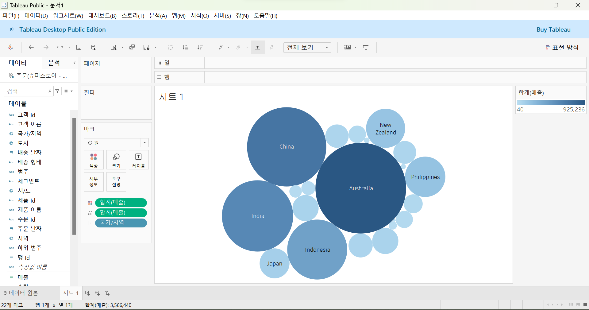
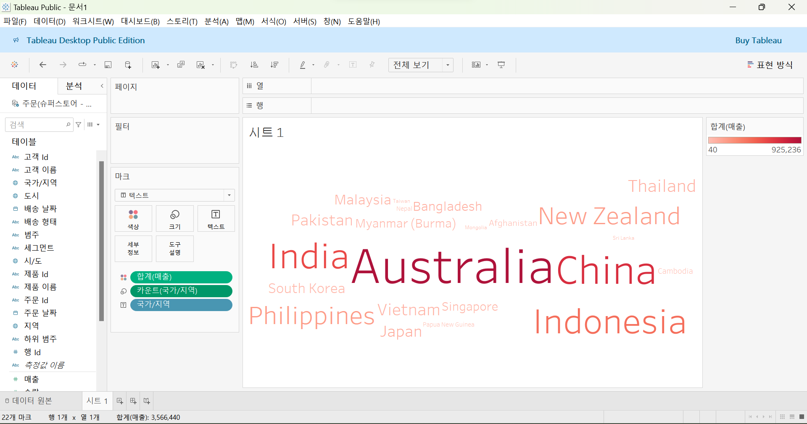
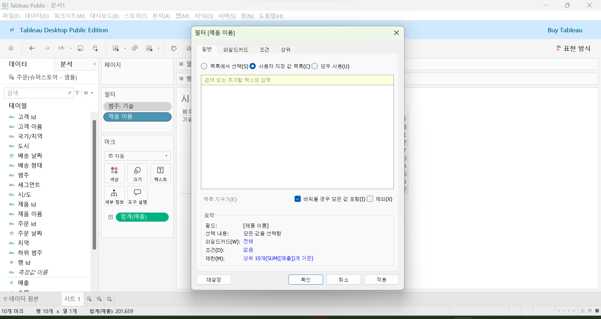
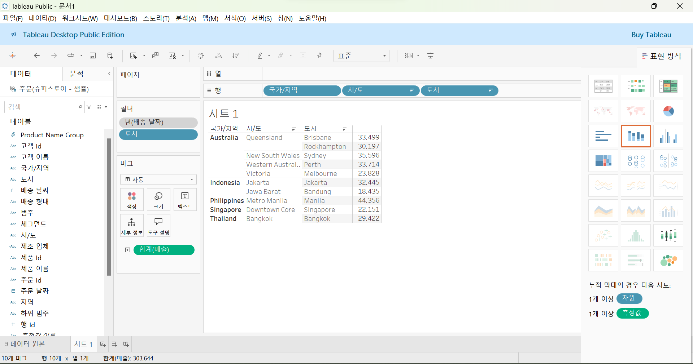
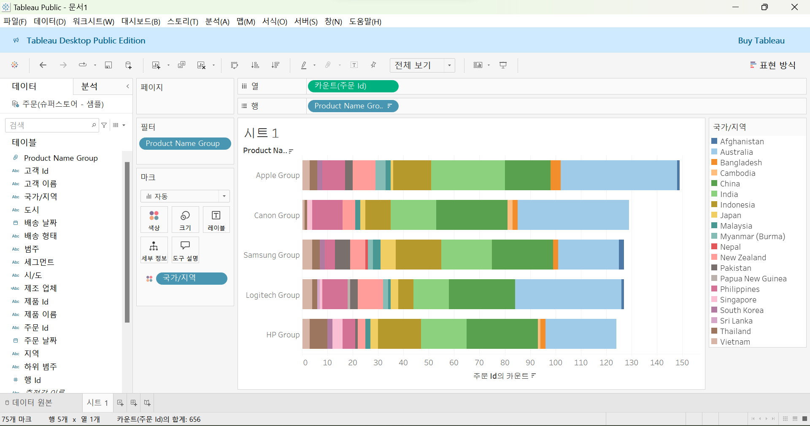

# Third Study Week

- 20강: [파이와 도넛차트](#20강-파이와-도넛차트)

- 21강: [워드와 버블차트](#21강-워드와-버블차트)

- 22강: [이중축과 결합축](#22강-이중축과-결합축)

- 23강: [분산형 차트](#23강-분산형-차트)

- 24강: [히스토그램](#24강-히스토그램)

- 25강: [박스플롯](#25강-박스플롯)

- 26강: [영역차트](#26강-영역차트)

- 27강: [간트차트](#27강-간트차트)

- 28강: [필터](#28강-필터)

- 29강: [그룹](#29강-그룹)


- 문제1 : [문제1](#문제1)

- 문제2 : [문제2](#문제2)

- 참고자료 : [참고자료](#참고-자료)


## Study Schedule

| 강의 범위     | 강의 이수 여부 | 링크                                                                                                        |
|--------------|---------|-----------------------------------------------------------------------------------------------------------|
| 1~9강        |  ✅      | [링크](https://youtu.be/3ovkUe-TP1w?si=CRjj99Qm300unSWt)       |
| 10~19강      | ✅      | [링크](https://www.youtube.com/watch?v=AXkaUrJs-Ko&list=PL87tgIIryGsa5vdz6MsaOEF8PK-YqK3fz&index=75)       |
| 20~29강      | ✅      | [링크](https://www.youtube.com/watch?v=Qcl4l6p-gHM)      |
| 30~39강      | 🍽️      | [링크](https://www.youtube.com/watch?v=e6J0Ljd6h44&list=PL87tgIIryGsa5vdz6MsaOEF8PK-YqK3fz&index=55)       |
| 40~49강      | 🍽️      | [링크](https://www.youtube.com/watch?v=AXkaUrJs-Ko&list=PL87tgIIryGsa5vdz6MsaOEF8PK-YqK3fz&index=45)       |
| 50~59강      | 🍽️      | [링크](https://www.youtube.com/watch?v=AXkaUrJs-Ko&list=PL87tgIIryGsa5vdz6MsaOEF8PK-YqK3fz&index=35)       |
| 60~69강      | 🍽️      | [링크](https://www.youtube.com/watch?v=AXkaUrJs-Ko&list=PL87tgIIryGsa5vdz6MsaOEF8PK-YqK3fz&index=25)       |
| 70~79강      | 🍽️      | [링크](https://www.youtube.com/watch?v=AXkaUrJs-Ko&list=PL87tgIIryGsa5vdz6MsaOEF8PK-YqK3fz&index=15)       |
| 80~89강      | 🍽️      | [링크](https://www.youtube.com/watch?v=AXkaUrJs-Ko&list=PL87tgIIryGsa5vdz6MsaOEF8PK-YqK3fz&index=5)        |


<!-- 여기까진 그대로 둬 주세요-->
<!-- 이 안에 들어오는 텍스트는 주석입니다. -->

# Third Study Week

## 20강: 파이와 도넛차트
<!-- 파이와 도넛차트에 관해 배우게 된 점을 적어주세요 -->
전체에 대한 비율을 표시할 때 주로 사용됨

파이차트는 축을 따로 가지고 있지 않기 때문에 임의의 축을 설정해줘야 함

> **🧞‍♀️ 도넛차트를 생성하는 법을 기록해주세요.**

열 선반 더블클릭 > 아무거나 치고 복제 > 원그래프가 2개 생김 > 수정 후 이중축 설정\
시트 > 우클릭 > 서식 > 행 구분선, 열 구분선 '없음'\
시트 > 축선택 > 우클릭 > 머리글 표시 해제

## 21강: 워드와 버블차트
<!-- 워드와 버블차트에 관해 배우게 된 점을 적어주세요 -->
- 버블차트


- 워드 클라우드\
: 문서 내에서 등장하는 키워드가 얼마나 자주 등장하는지를 텍스트 크기로 시각화할 수 있는 차트

⭐ 마크창 > 크기 > 카운트(국가/지역) ⭐

## 22강: 이중축과 결합축
<!-- 이중축과 결합축에 관해 배우게 된 점을 적어주세요 -->
이중축을 쓸 경우에는 마크를 각각의 축에 개별적으로 적용할 수 있지만, 결합된 축은 하나의 축을 공유하는 차트이다.

## 23강: 분산형 차트
<!-- 분산형 차트에 관해 배우게 된 점을 적어주세요 -->
 파라미터 간의 **상관관계**를 파악하는데 유용한 그래프
 -> 추세선 많이 활용 !
 - 범주별 추세선 추가\
 왼쪽 상단 분석 > 모델 > 추세선 > 드래그
 - 범주에 상관없이 추세선을 추가하려면?\
 추세선 우클릭 > 모든 추세선 편집 > 요소 > 범주 체크 해제

열 필드 복제, 이중축을 활용하여 두 추세선 모두 표시할 수도 있음 

```js
강의 영상과 달리, 우리 파일에는 '제조 업체' 필드가 없습니다. 필요한 경우, 계산된 필드를 이용해 'SPLIT([제품 이름], ' ', 1)'를 '제조 업체'로 정의하시고 세부 정보에 놓아주세요.
```

## 24강: 히스토그램
<!-- 히스토그램에 관해 배우게 된 점을 적어주세요 -->


## 25강: 박스플롯
<!-- 박스플롯에 관해 배우게 된 점을 적어주세요 -->

## 26강: 영역차트
<!-- 영역차트에 관해 배우게 된 점을 적어주세요 -->

## 27강: 간트차트
<!-- 간트차트에 관해 배우게 된 점을 적어주세요 -->
시간 경과에 따른 기간을 시각화하는데 사용됨

## 28강: 필터
<!-- 필터에 관해 배우게 된 점을 적어주세요 -->

태블로가 통합 문서에서 필터를 실행하는 순서?
추출, 데이터원본, 컨텍스트, 차원, 측정값 순으로
1. 추출; 데이터를 Tableau로 가져올 때 특정 데이터만 가져오도록 필터링하는 단계

2. 데이터 원본 필터; 작업을 위한 데이터 중 **일부만 워크 스페이스에 불러올 때** 사용함

3. 컨텍스트 필터; 각 필터가 다른 필터에 관계 없이 모든 행에 액세스하도록 작동하는데 여러가지 필터를 설정했을 때 컨텍스트 필터로 지정해주면 다른 필터가 컨텍스트 필터에 종속되어 작동함\
How? 필터에서 마우스 우클릭 > 컨텍스트에 추가 > 필터 우선적 적용\
Tip! 종속 필터를 필터 선반에 두기 이전에 컨텍스트 필터를 먼저 설정하면 쿼리 속도가 향상됨

4. 차원 필터; 차원 필드(범주형 데이터)에 대한 필터
이미 필터에 있는 필드를 다시 넣었을 때 새로운 창이 나옴


## 29강: 그룹
<!-- 그룹에 관해 배우게 된 점을 적어주세요 -->
데이터를 표시하는 방법? **그룹, 계층, 집합**\
그룹을 이용해 수동으로 **필드(차원)에 있는 항목들을 묶을 수 있으며**, 기존 데이터 원본에 없는 사용자 지정 그룹 필드를 만들 수 있음

그룹을 만드는 방법 1) 뷰에서 그룹을 만드는 방법
같은 그룹 드래그 > 우클릭 > 그룹

그룹을 만드는 방법 2) 항목별로 묶을 필드를 선택하여 만드는 방법
제품 이름 우클릭 > 만들기 > 그룹


## 문제 1.

```js
유정이는 superstore 데이터셋에서 '주문' 테이블을 보고 있습니다.
1) 국가/지역 - 시/도- 도시 의 계층을 생성했습니다. 계층 이름은 '위치'로 설정하겠습니다.
2) 날짜의 데이터 타입을 '날짜'로 바꾸었습니다.

코로나 시기의 도시별 매출 top10을 확인하고자
1) 배송 날짜가 코로나시기인 2021년, 2022년에 해당하는 데이터를 필터링했고
2) 위치 계층을 행으로 설정해 펼쳐두었습니다.
이때, 매출의 합계가 TOP 10인 도시들만을 보았습니다.
```


```
겉보기에는 전체 10개로, 잘 나온 결과처럼 보입니다. 그러나 유정이는 치명적인 실수를 저질렀습니다.
오늘 배운 '컨텍스트 필터'의 내용을 고려하여 올바른 풀이 및 결과를 구해주세요.
```

<!-- DArt-B superstore가 아닌 개인 superstore 파일을 사용했다면 값이 다르게 표시될 수 있습니다.-->


⭐ 필터 걸 때 매출에 대해x 도시에 대해!!! \
년(배송 날짜)을 컨텍스트 필터로 먼저 적용하고 해당 데이터 내에서 상위 10개 도시의 필터를 적용해야함
## 문제 2.

```js
태영이는 관심이 있는 제품사들이 있습니다. '제품 이름' 필드에서 '삼성'으로 시작하는 제품들을 'Samsung group'으로, 'Apple'으로 시작하는 제품들을 'Apple group'으로, 'Canon'으로 시작하는 제품들을 'Canon group'으로, 'HP'로 시작하는 제품들을 'HP group', 'Logitech'으로 시작하는 제품들을 'Logitech group'으로 그룹화해서 보려고 합니다. 나머지는 기타로 설정해주세요. 이 그룹화를 명명하는 필드는 'Product Name Group'으로 설정해주세요.

(이때, 드래그보다는 멤버 찾기 > 시작 문자 설정하여 모두 찾아 한번에 그룹화해 확인해보세요.)
```


```js
해당 그룹별로 어떤 국가/지역이 주문을 많이 차지하는지를 보고자 합니다. 매출액보다는 주문량을 보고 싶으므로, 주문Id의 카운트로 계산하겠습니다.

기타를 제외하고 지정한 5개의 그룹 하위 목들만을 이용해 아래와 같이 지역별 누적 막대그래프를 그려봐주세요.
```



내가 만든 누적 막대그래프~.~\
팔레트에 색이 보통 20개까지 있어서 팔레트 설정하려면 (국가) 20개 이하로 하는 게 좋댕
## 🧽Clear!🫧