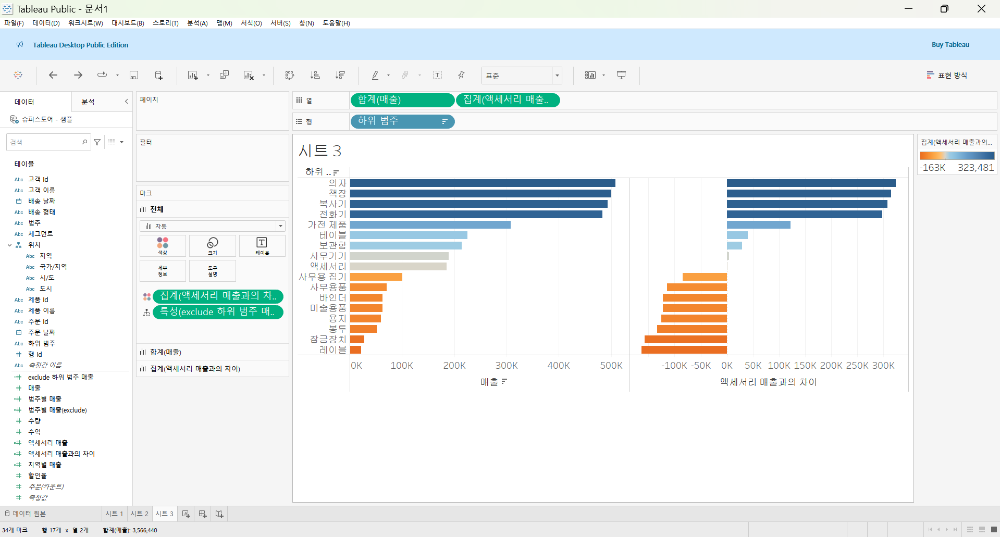
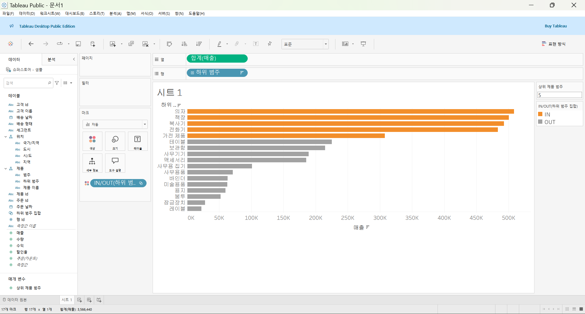
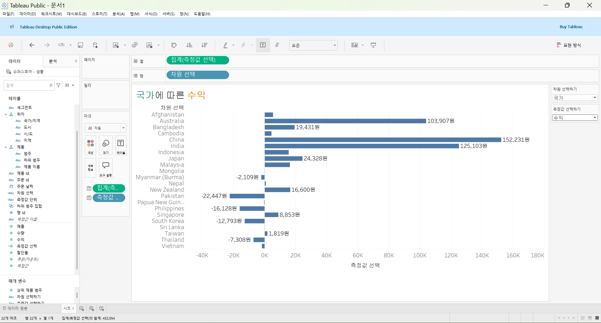
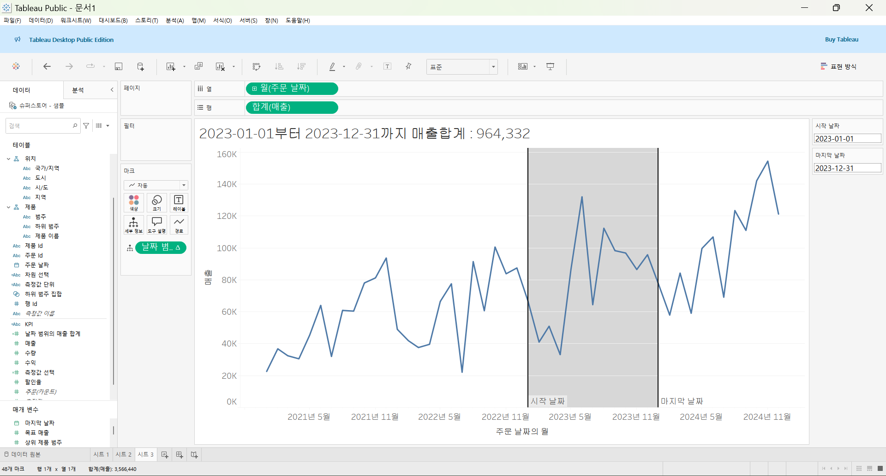

# Fifth Study Week

- 39강: [LOD](#39강-lod)

- 40강: [EXCLUDE](#40-lod-exclude)

- 41강: [INCLUDE](#41-lod-include)

- 42강 : [매개변수](#42-매개변수)

- 43강 : [매개변수 실습](#43-매개변수-실습) 


- 44강: [매개변수 실습](#44-매개변수-실습)

- 45강: [마크카드](#45-워크시트-마크카드)

- 46강: [서식계층](#46-서식-계층)

- 47강: [워크시트](#47-워크시트-서식)

- [문제1](#문제-1)

- [문제2](#문제-2)

## Study Schedule

| 강의 범위     | 강의 이수 여부 | 링크                                                                                                        |
|--------------|---------|-----------------------------------------------------------------------------------------------------------|
| 1~9강        |  ✅      | [링크](https://www.youtube.com/watch?v=AXkaUrJs-Ko&list=PL87tgIIryGsa5vdz6MsaOEF8PK-YqK3fz&index=84)       |
| 10~19강      | ✅      | [링크](https://www.youtube.com/watch?v=AXkaUrJs-Ko&list=PL87tgIIryGsa5vdz6MsaOEF8PK-YqK3fz&index=75)       |
| 20~29강      | ✅      | [링크](https://www.youtube.com/watch?v=AXkaUrJs-Ko&list=PL87tgIIryGsa5vdz6MsaOEF8PK-YqK3fz&index=65)       |
| 30~38강      | ✅      | [링크](https://www.youtube.com/watch?v=e6J0Ljd6h44&list=PL87tgIIryGsa5vdz6MsaOEF8PK-YqK3fz&index=55)       |
| 39~47강      | ✅      | [링크](https://www.youtube.com/watch?v=AXkaUrJs-Ko&list=PL87tgIIryGsa5vdz6MsaOEF8PK-YqK3fz&index=45)       |
| 48~59강      | 🍽️      | [링크](https://www.youtube.com/watch?v=AXkaUrJs-Ko&list=PL87tgIIryGsa5vdz6MsaOEF8PK-YqK3fz&index=35)       |
| 60~69강      | 🍽️      | [링크](https://www.youtube.com/watch?v=AXkaUrJs-Ko&list=PL87tgIIryGsa5vdz6MsaOEF8PK-YqK3fz&index=25)       |
| 70~79강      | 🍽️      | [링크](https://www.youtube.com/watch?v=AXkaUrJs-Ko&list=PL87tgIIryGsa5vdz6MsaOEF8PK-YqK3fz&index=15)       |
| 80~89강      | 🍽️      | [링크](https://www.youtube.com/watch?v=AXkaUrJs-Ko&list=PL87tgIIryGsa5vdz6MsaOEF8PK-YqK3fz&index=5)        |


<!-- 여기까진 그대로 둬 주세요-->

> **🧞‍♀️ 오늘의 스터디는 지니와 함께합니다.**


## 39강. LOD

<!-- INCLUDE, EXCLUDE, FIXED 등 본 강의에서 알게 된 LOD 표현식에 대해 알게 된 점을 적어주세요. -->
LOD(Level Of Detail) : 계산할 수준을 세부적으로 제어 가능하도록 함\
FIXED : 지정된 차원만 사용하여 집계를 계산한다\
FIXED는 설정한 차원이 뷰에 포함되어 있을 때, 포함되어 있지 않을 때 둘 다 사용한다

하위 범주를 뷰에서 제외해도 계산할 때 해당 하위 범주들을 포함해 계산하기 위해 계산된 필드{ FIXED : sum([매출]) } =전체 매출, sum([매출])/sum([전체 매출]) 사용


## 40. LOD EXCLUDE

<!-- INCLUDE, EXCLUDE, FIXED 등 본 강의에서 알게 된 LOD 표현식에 대해 알게 된 점을 적고, 아래 두 질문에 답해보세요 :) -->
EXCLUDE LOD : 현재 뷰에서 특정 차원을 제외하여 계산할 때 사용한다

> **🧞‍♀️ FIXED와 EXCLUDE을 사용하는 경우의 차이가 무엇인가요?**

```
FIXED: 특정 차원으로 "고정된" 집계 → 뷰의 필터 영향을 받지 않음
EXCLUDE: 특정 차원을 제외하고 집계 → 뷰의 필터 영향을 받음

{ FIXED [제조업체] : SUM([판매]) }는 제조업체 수준에서 판매 총합을 계산하며, 이후에 추가되는 필터가 "제조업체 필드와 관련되지 않는 한" 결과 값에는 영향을 주지 않는다.

EXCLUDE는 지정한 차원을 제외하고 나머지 차원으로 집계를 계산하는데, 뷰에 세부 수준이 더 낮은 차원이 추가되면 해당 추가된 차원이 집계 계산에 영향을 미친다.

⇒ 고정된 집계를 원할 때는 FIXED를 사용하고, 뷰에 따라 동적으로 계산된 값을 원할 때는 EXCLUDE를 사용하는 것이 적절하다.
```

> **🧞‍♀️ 왜 ATTR 함수를 사용하나요?**

```
ATTR : 그룹의 모든 행에 대해 "단일 값"만 포함하면 주어진 식의 값을 반환하고, 그렇지 않으면 별표를 표시하며 Null 값은 무시된다. 집계 수준에서 단일 값이 필요할 때 유용하게 사용된다.

SUM([매출]) - ATTR([exclude 하위 범주 매출])에서 ATTR을 사용하는 이유는 [exclude 하위 범주 매출]이 동일한 값을 갖도록 강제하고, 각 하위 범주별로 변동이 없게 하기 위해서이다. 
```



## 41. LOD INCLUDE

<!-- INCLUDE, EXCLUDE, FIXED 등 본 강의에서 알게 된 LOD 표현식에 대해 알게 된 점을 적고, 아래 두 질문에 답해보세요 :) -->
AVG ( {INCLUDE [주문ID] : SUM([매출])}) : 주문ID 차원을 포함해서 합계한 매출의 평균을 반환한다\
주문ID 차원을 현재 뷰에서 표시하지 않지만 INCLUDE LOD 표현식을 통해 해당 차원을 계산에 추가할 수 있다

> **🧞‍♀️ 그렇다면 어떤 경우에 각 표현식을 사용하나요? 예시와 함께 적어보아요**


```
- FIXED는 뷰에서 고정된 차원 수준에서의 집계 제공(차원 필터의 영향을 받지 않음)
보고서 전체에서 일관된 기준으로 계산된 값을 표시하고자 할 때.
예) {FIXED [Region] : SUM([Sales])} : 고정된 기준으로 지역별 매출 합계 계산 

- INCLUDE는 뷰에 표시된 차원에 추가 차원을 포함하여 집계 계산(차원 필터의 영향을 받음)
특정 차원을 추가적으로 고려하여 세부적인 집계 계산을 수행하고자 할 때.
필터가 적용된 데이터에 따라 세부적인 값을 계산해야 할 때.
예) {INCLUDE [Customer Segment] : SUM([Sales])} : 특정 고객 세그먼트별 추가 세부 사항 포함한 판매량 합계 계산

- EXCLUDE는 특정 차원을 제외하고 집계 계산(차원 필터의 영향을 받음)
특정 차원을 제외한 집계 계산이 필요할 때.
뷰의 특정 차원을 제거하여 더 높은 수준에서 계산해야 할 때.
예) {EXCLUDE [Sub-Category] : SUM([Sales])} : 서브 카테고리를 제외한 카테고리별 매출 합계 계산

뷰에 표시되는 값이 차원 > FIXED LOD 표현식 사용
INCLUDE, EXCLUDE LOD 표현식들은 측정값만 반환한다
반환값을 차원 필터의 영향을 받게 되는 경우 > INCLUDE, EXCLUDE LOD 표현식 사용
```

## 42. 매개변수

<!-- 매개변수에 대해 알게 된 점을 적어주세요 -->
고정된 상수값이 아닌 동적인 값으로 변경하기 위해서 활용하는 기능\
계산식, 필터, 참조선을 함께 사용해야 작동됨

> **🧞‍♀️ 집합에도 매개변수를 적용할 수 있나요? 시도해봅시다**


## 43. 매개변수 실습
<!-- 영상 묶음에 포함되지 않아 찾기 어려우실까 링크를 아래에 첨부하겠습니다. 수강 후 삭제해주세요-->
계산식 활용\
매개변수는 단독으로 사용할 수 없으므로 매개변수를 작동시킬 계산된 필드를 만들어야 함

시트 제목 > 삽입 > 매개 변수에 따라 이름 바뀌게 설정 가능



## 44. 매개변수 실습

<!-- 매개변수에 대해 알게 된 점을 적어주세요 -->
참조선 활용


## 45. 워크시트 마크카드

<!-- 마크카드에 대해 알게 된 점을 적어주세요 -->
태블로는 레이블이 다른 레이블과 겹치는 경우에 자동으로 레이블을 숨긴다 > "레이블이 다른 마크와 겹치도록 허용" 옵션


## 46. 서식 계층

<!-- 서식계층에 대해 알게 된 점을 적어주세요 -->

> **🧞‍♀️ 서식계층을 일반적인 것에서 구체적인 것 순서로 기입해보세요**


```
1. 워크 시트 서식
2. 행 / 열 서식
3. 특정 필드
4. 필드 레이블
5. 도구설명 / 제목 / 마크
```
더 구체적인 계층의 설정을 따라간다

## 47. 워크시트 서식

<!-- 워크시트 서식에 대해 알게 된 점을 적어주세요!-->
서식 > 글꼴 / 맞춤 / 음영


## 문제 리스트


## 문제 1.

```
가장 많이 주문한 사람들은 물건 배송을 빨리 받았을까요?
조건을 준수하여 아래 이미지를 만들어봆시다.
1) 국가/지역별(이하 '나라'로 통칭), 범주별로 배송일자가 다를 수 있으니 먼저, 나라별/범주별로 평균 배송일자를 설정한 뒤,
2) 각 나라에서 가장 많이 주문한 사람의 이름을 첫 번째 열,
3) 그 사람이 주문한 제품 이름을 2번째 열,
4) 각 상품이 배송까지 걸린 날 수를 표현하고
5) 그리고 만약 배송이 각 나라/범주별 평균보다 빨랐다면 '빠름', 같다면 '평균', 느리다면 '느림' 으로 print 해주세요. 
```


<!-- 여기까지 오는 과정 중 알게 된 점을 기입하고, 결과는 시트 명을 본인 이름으로 바꾸어 표시해주세요.-->

## 문제 2.

```
채원이는 태블로를 쓰실 수 없는 상사분께 보고하기 위한 대시보드를 만들고 싶어요. 

제품 중분류별로 구분하되 매개변수로써 수익, 매출, 수량을 입력하면 저절로 각각 지표에 해당하는 그래프로 바뀌도록 설계하고자 해요.

 어떤 값이 각 지표의 평균보다 낮은 값을 갖고 있다면 색깔을 주황색으로, 그것보다 높다면 파란색으로 표시하고 싶어요. 그 평균값은 각 지표별로 달라야 해요.
```


<!-- 예시 사진은 지워주세요-->