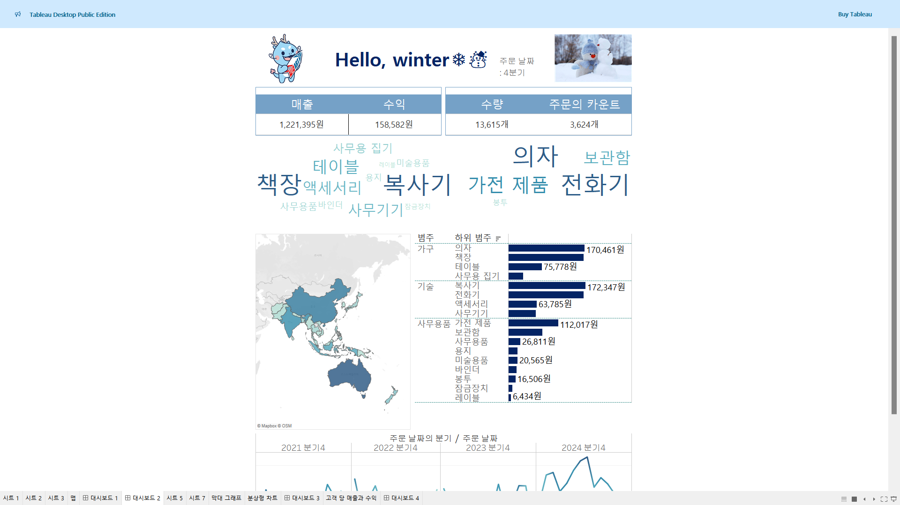
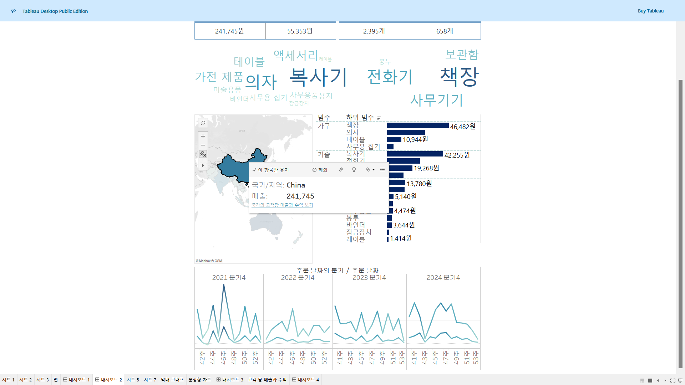
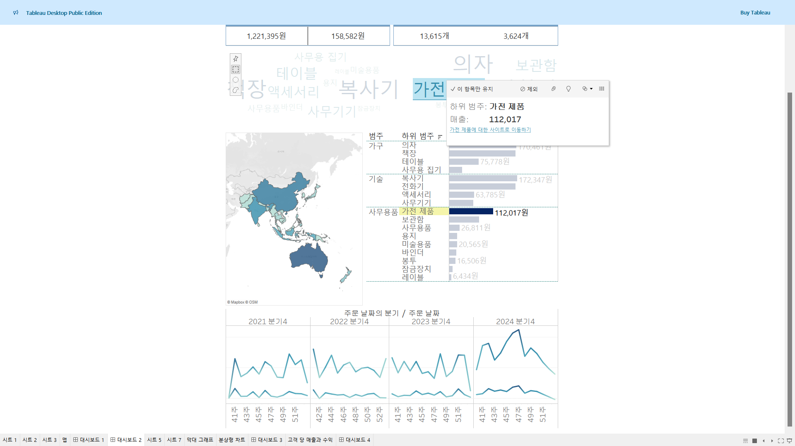

# Sixth Study Week


## Study Schedule
<br>

| 회차 | 강의 범위   | 강의 이수 여부 | 링크                                                                                                     |
|------|-------------|----------------|--------------------------------------------------------------------------------------------------------|
| 1    | 1~7강       | ✅              | [링크](https://www.youtube.com/watch?v=AXkaUrJs-Ko&list=PL87tgIIryGsa5vdz6MsaOEF8PK-YqK3fz&index=84)    |
| 2    | 8~17강      | ✅              | [링크](https://www.youtube.com/watch?v=AXkaUrJs-Ko&list=PL87tgIIryGsa5vdz6MsaOEF8PK-YqK3fz&index=75)    |
| 3    | 18~27강     | ✅              | [링크](https://www.youtube.com/watch?v=AXkaUrJs-Ko&list=PL87tgIIryGsa5vdz6MsaOEF8PK-YqK3fz&index=65)    |
| 4    | 28~37강     | ✅              | [링크](https://www.youtube.com/watch?v=e6J0Ljd6h44&list=PL87tgIIryGsa5vdz6MsaOEF8PK-YqK3fz&index=55)    |
| 5    | 38~47강     | ✅              | [링크](https://www.youtube.com/watch?v=AXkaUrJs-Ko&list=PL87tgIIryGsa5vdz6MsaOEF8PK-YqK3fz&index=45)    |
| 6    | 48~57강     | ✅              | [링크](https://www.youtube.com/watch?v=AXkaUrJs-Ko&list=PL87tgIIryGsa5vdz6MsaOEF8PK-YqK3fz&index=35)    |
| 7    | 58~67강     | 🍽️             | [링크](https://www.youtube.com/watch?v=AXkaUrJs-Ko&list=PL87tgIIryGsa5vdz6MsaOEF8PK-YqK3fz&index=25)    |
| 8    | 68~77강     | 🍽️             | [링크](https://www.youtube.com/watch?v=AXkaUrJs-Ko&list=PL87tgIIryGsa5vdz6MsaOEF8PK-YqK3fz&index=15)    |
| 9    | 78~85강     | 🍽️             | [링크](https://www.youtube.com/watch?v=AXkaUrJs-Ko&list=PL87tgIIryGsa5vdz6MsaOEF8PK-YqK3fz&index=5)     |
---

<br/>
<!-- 여기까진 그대로 둬 주세요-->

> **🧞‍♀️ 오늘은 강의보다 실습과 대시보드 직접 만들기가 더 중요하니, 기록보다는 사고하며 강의를 들어주세요.**

## 48. 워크시트 서식(2)

<!-- 워크시트에 관해 본 강의에서 알게 된 점을 적어주세요 -->
테두리와 라인의 차이는 데이터를 기준으로 구분할 수 있는데 
- 테두리 서식은 뷰에서 테이블, 패널, 셀 및 머리글을 둘러싸는 라인의 서식을 설정
- 라인 서식은 뷰에서 표시된 데이터의 축에 대한 라인의 모양을 설정할 수 있음


수준 설정에 따라 라인이 표시되는 위치와 형태가 달라짐

## 49강. 대시보드패널

<!-- 대시보드패널 강의에서 알게 된 점을 적어주세요. -->
대시보드 디자인 페이지 = 각 시트와 개체들을 배치할 수 있는 공간

## 50. 대시보드 구성방식

<!-- 알게 된 점을 적고, 아래 질문에 답해보세요 :) -->
태블로 내 대시보드에 개체를 추가하는 구성 방식
- 바둑판식
- 부동

대시보드의 크기가 자주 변경되는 경우에 개체를 추가하면 바둑판식을 사용하는 것을 추천
바둑판식으로 개체들을 추가하면 대시보드 크기를 변경해도 개체가 유사한 형식을 유지할 수 있음
대시보드 크기를 변경하면 텍스트 개체의 위치가 변경됨
부동 개체는 대시보드 크기가 자주 변경되지 않는 경우에 사용하는 것이 좋습니다

> **🧞‍♀️ 부동과 바둑판식 방식을 차이를 중점으로 기술해보세요**

대시보드에서 개체(위젯, 텍스트 상자 등)를 배치하는 방식에는 부동 방식(floating layout)과 바둑판식(grid layout) 방식이 있으며, 각각 대시보드의 크기나 해상도가 바뀔 때 개체들이 배치되는 방식에 차이가 있습니다.

1. 부동 방식 (Floating Layout)\
개체가 고정된 위치에 배치됩니다.
대시보드의 크기를 조정해도 개체들이 처음 설정한 위치와 크기를 그대로 유지하려고 합니다.
일반적으로 절대 위치로 배치되며, 크기 변경 시 일부 개체가 겹치거나 화면 밖으로 벗어날 수 있습니다.
화면 크기가 변해도 개체가 원래 위치에서 이동하지 않기 때문에, 레이아웃을 디자인한 사람의 의도대로 개체가 유지되는 특징이 있습니다.

2. 바둑판식 방식 (Grid Layout)\
개체가 격자(grid) 형태로 배치됩니다.
대시보드의 크기나 화면 비율이 변하면, 개체들이 격자 기준으로 위치와 크기를 조정합니다.
격자 안에서 개체가 배치되므로, 대시보드의 크기가 변해도 비율에 맞게 정렬됩니다.
개체들이 유연하게 크기와 위치를 조정하여 화면 크기가 바뀌어도 일관성 있게 보이도록 구성할 수 있습니다.


## 51. 대시보드 컨테이너
컨테이너 = 대시보드 개체들과 워크시트들을 그룹화하고 구성할 수 있는 공간\
가로/세로\
가로 컨테이너 -> 내부의 개체들을 수평 공간으로 배열할 때 사용\
세로 컨테이너 -> 내부의 개체들을 수직 공간으로 배열할 때 사용

## 52. 레이아웃 패널
부동 옵션을 선택했다가 다시 해제해도 해당 개체가 이전의 위치로 돌아가지 않는다.

## 53. 필터 동작

<!-- 필터 동작에 대해 알게 된 점을 적어주세요 -->
마우스오버 (Hover): 마우스를 올렸을 때 실행\
선택 (Select): 클릭 시 실행\
메뉴 (Menu): 클릭 시 메뉴가 표시되고, 메뉴에서 선택할 수 있도록 설정

## 54. 대시보드 하이라이터 동작

<!-- 하이라이터에 대해 알게 된 점을 적어주세요 -->
전체 데이터에서 선택한 조건에 따라 데이터를 하이라이트로 구분할 수 있는지 실습

→ 원하는 제품의 하위 범주를 나머지 데이터와 구별하기 위해 하이라이트 동작 사용


!! 대시보드 하이라이트 동작이 작동하려면 선택 기준으로 사용하는 필드가 변경할 그래프에 포함되어 있어야 함 !!

## 55. 대시보드 URL

<!-- URL에 대해 알게 된 점을 적어주세요 -->
웹사이트 동작 기능들을 만들기 위해서는 URL로 이동 동작을 설정해야 한다.

대시보드 > 동작 > 동작 추가 > url로 이동

웹페이지 개체에서 url을 열어 보려면 '웹 페이지 개체가 없는 경우 새 탭' 또는 '웹 페이지 개체'(대시보드에 웹 페이지 개체가 있는 경우에) 옵션을 선택해야 함


## 56. 대시보드 시트에 이동 동작

<!-- 대시보드 시트에 이동에 대해 알게 된 점을 적어주세요!-->
탐색 추가


Alt + 클릭 > 대시보드 이동

## 57. 매개변수 변경 동작

<!-- 매개변수 변경 동작에 대해 알게 된 점을 적어주세요!-->
특정 날짜 범위의 데이터만 보려면?

주문 날짜 필터 → 필터 카드에 넣고 "참"으로 설정
```
DATETRUNC('month', [주문 날짜]) >= [주문 날짜 시작 매개 변수]
AND DATETRUNC('month', [주문 날짜]) <= [주문 날짜 시작 매개 변수]
```
동작 추가 > 매개 변수 변경 > 시작 날짜, 마지막 날짜 설정 각각 생성

## 문제

오늘은 별도의 문제가 없습니다. 

여러 대시보드를 참고하시어, superstore 데이터를 사용해 나만의 대시보드를 제작해주세요.

**단, 워크시트 3개 이상의 그래프를 표시해야 하며 각 시트 간 상호작용성 필터 or 하이라이트 동작은 꼭 추가되어야 합니다**

어떤 부분에 가중을 두었는지, 어떤 사용자 편의성을 고려하였는지에 대한 설명이 필요합니다.

[대시보드 링크](https://public.tableau.com/views/_1_17314287107920/2_1?:language=ko-KR&:sid=&:redirect=auth&:display_count=n&:origin=viz_share_link)





슈퍼스토어의 4분기 주문에 대한 대시보드를 만들어보았다. 맵의 국가/지역별로 막대 그래프와 꺾은선 그래프가 바뀌게 설정했다. \
워드 클라우드에서 하위범주 중 하나를 선택하면 해당 매출 막대가 하이라이트된다. 또한, <하위 범주>에 대한 사이트로 이동하기를 통해 제품 판매 사이트로 바로 이동할 수 있게 설정했다.(실제 제품 url이 없어서 위키피디아로 대체)
